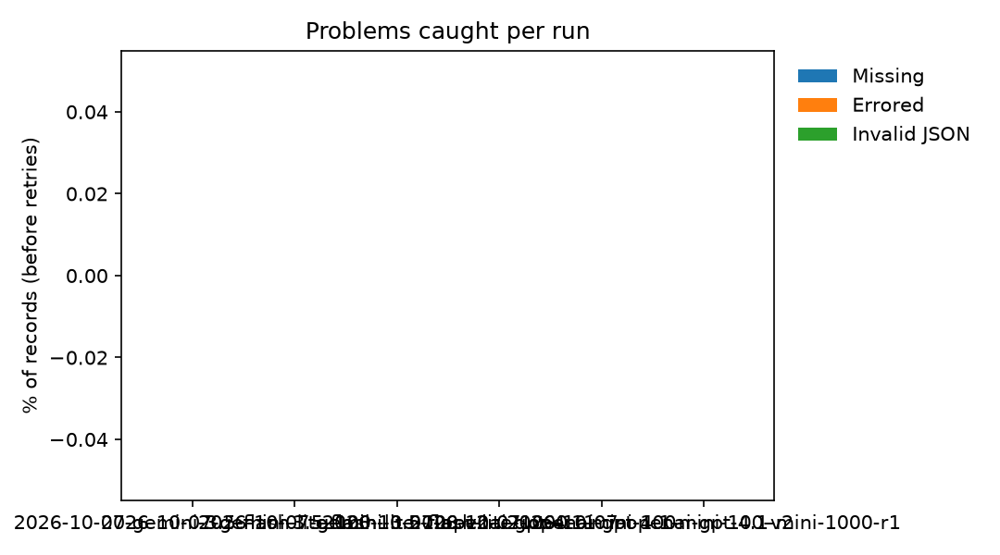
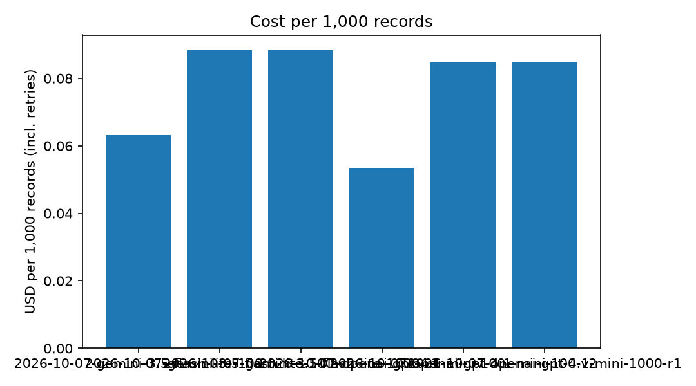

# Benchmark results

Counts of missing, errored and invalid lines are before retries; OK and Failed are after retries.

| Run | Provider | Model | Records | OK | Failed | Missing | Errored | Invalid | Retried | Median batch (s) | Slowest batch (s) | Cost per 1k ($) | Accuracy |
|---|---|---|---|---|---|---|---|---|---|---|---|---|---|
| 2026-10-07-gemini-3.5-flash-lite-100 | gemini | gemini-3.5-flash-lite | 100 | 100 | 0 | 0 | 0 | 0 | 0 | 212.8 | 212.8 | 0.0631 | 0.7625 |
| 2026-10-07-gemini-3.5-flash-lite-100-v2 | gemini | gemini-3.5-flash-lite | 100 | 100 | 0 | 0 | 0 | 0 | 0 | 182.4 | 182.4 | 0.0884 | 0.96 |
| 2026-10-07-gemini-3.5-flash-lite-1000-r1 | gemini | gemini-3.5-flash-lite | 1000 | 1000 | 0 | 0 | 0 | 0 | 0 | 182.4 | 182.4 | 0.0883 | 0.9545 |
| 2026-10-07-openai-gpt-4.1-mini-100 | openai | gpt-4.1-mini | 100 | 100 | 0 | 0 | 0 | 0 | 0 | 182.1 | 182.1 | 0.0534 | 0.7375 |
| 2026-10-07-openai-gpt-4.1-mini-100-v2 | openai | gpt-4.1-mini | 100 | 100 | 0 | 0 | 0 | 0 | 0 | 91.7 | 91.7 | 0.0848 | 0.985 |
| 2026-10-07-openai-gpt-4.1-mini-1000-r1 | openai | gpt-4.1-mini | 1000 | 1000 | 0 | 0 | 0 | 0 | 0 | 242.4 | 242.4 | 0.085 | 0.9772 |

